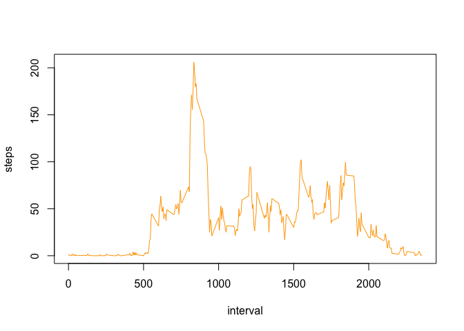

# Reproducible Research: Peer Assessment 1


```
## Warning: package 'ggplot2' was built under R version 3.2.4
```

## Loading and preprocessing the data

Dataset: [Activity monitoring data](https://d396qusza40orc.cloudfront.net/repdata%2Fdata%2Factivity.zip) [52K]

The variables included in this dataset are:

- **steps**: Number of steps taking in a 5-minute interval (missing values are coded as NA)

- **date**: The date on which the measurement was taken in YYYY-MM-DD format

- **interval**: Identifier for the 5-minute interval in which measurement was taken

The dataset is stored in a comma-separated-value (CSV) file and there are a total of 17,568 observations in this dataset.


1. Load the data

    
    ```r
    activity <- read.csv("activity.csv", header = T)
    ```


2. Process/transform the data (if necessary) into a format suitable for your analysis

    
    ```r
    stepsPerDay <- aggregate(steps ~ date, data=activity, sum, na.rm=TRUE)
    stepsPerDay$date <- as.Date(stepsPerDay$date)
    ```

## What is mean total number of steps taken per day?


1. Make a histogram of the total number of steps taken each day

    
    ```r
    barplot(stepsPerDay$steps, names.arg = stepsPerDay$date, xlab = "Date"
            , ylab = "Steps", col = "orange")
    ```
    
    <!-- -->


2. Calculate and report the mean and median total number of steps taken per day

- **Mean:**
    
    ```r
    mean(stepsPerDay$steps)
    ```
    
    ```
    ## [1] 10766.19
    ```

- **Median:**
    
    ```r
    median(stepsPerDay$steps)
    ```
    
    ```
    ## [1] 10765
    ```


## What is the average daily activity pattern?

1. Make a time series plot (i.e. type = "l") of the 5-minute interval (x-axis) and the average number of steps taken, averaged across all days (y-axis)

    
    ```r
    stepsPerInterval <- aggregate(steps ~ interval, data=activity, mean
                                  , na.rm=TRUE)
    plot(stepsPerInterval, type = "l", col = "orange")
    ```
    
    <!-- -->

2. Which 5-minute interval, on average across all the days in the dataset, contains the maximum number of steps?

    
    ```r
    stepsPerInterval[which.max(stepsPerInterval$steps),]
    ```
    
    ```
    ##     interval    steps
    ## 104      835 206.1698
    ```

## Imputing missing values

Note that there are a number of days/intervals where there are missing values (coded as NA). The presence of missing days may introduce bias into some calculations or summaries of the data.

1. Calculate and report the total number of missing values in the dataset (i.e. the total number of rows with NAs)

    
    ```r
    nrow(activity[is.na(activity$steps),])
    ```
    
    ```
    ## [1] 2304
    ```

2. Devise a strategy for filling in all of the missing values in the dataset. The strategy does not need to be sophisticated. For example, you could use the mean/median for that day, or the mean for that 5-minute interval, etc.

    - Now that we have the mean for each interval, we are going to use the variable *stepsPerInterval*
    
    ```r
    stepsPerInterval <- aggregate(steps ~ interval, data=activity, mean
                                  , na.rm=TRUE)
    activity.Merge <- merge(activity, stepsPerInterval, by = "interval")
    
    cond.IsNa <- is.na(activity.Merge$steps.x)
    activity.Merge[cond.IsNa,]$steps.x <- activity.Merge[cond.IsNa,]$steps.y
    activity.Merge <- activity.Merge[order(activity.Merge$date, activity.Merge$interval),]
    ```

3. Create a new dataset that is equal to the original dataset but with the missing data filled in.

    
    ```r
    activity.noNA <- data.frame(steps = activity.Merge$steps.x
                                , date = activity.Merge$date
                                , interval = activity.Merge$interval)
    ```


4. Make a histogram of the total number of steps taken each day and Calculate and report the mean and median total number of steps taken per day. Do these values differ from the estimates from the first part of the assignment? What is the impact of imputing missing data on the estimates of the total daily number of steps?

    
    ```r
    par(mfrow = c(1,2))
    
    barplot(stepsPerDay$steps, names.arg = stepsPerDay$date, xlab = "Date"
            , ylab = "Steps", col = "orange"
            , main = "Activities with NA values")
    
    stepsPerDay.noNA <- aggregate(steps ~ date, data = activity.noNA, sum
                                  , na.rm = TRUE)
    stepsPerDay.noNA$date <- as.Date(stepsPerDay.noNA$date)
    barplot(stepsPerDay.noNA$steps, names.arg = stepsPerDay.noNA$date
            , xlab = "Date", ylab = "Steps"
            , col = "orange", main = "Activities w/o NA values")
    ```
    
    <!-- -->

- **Mean:**
    
    ```r
    mean(stepsPerDay.noNA$steps)
    ```
    
    ```
    ## [1] 10766.19
    ```

- **Median:**
    
    ```r
    median(stepsPerDay.noNA$steps)
    ```
    
    ```
    ## [1] 10766.19
    ```
    
    - Taking the result of the mean and median operations, doesn't seem to be highly impacted by, from the whole data perspective. But if we see the data detailed by day, the impact are on those days where are more NA values, as expected.


## Are there differences in activity patterns between weekdays and weekends?

1. Create a new factor variable in the dataset with two levels -- "weekday" and "weekend" indicating whether a given date is a weekday or weekend day.

    
    ```r
    activity.wkd <- activity.noNA    
    cond.wknd <- weekdays(as.Date(activity.wkd$date)) %in% c('Saturday', 'Sunday')
    
    activity.wkd$type = ""
    activity.wkd[!cond.wknd,]$type <- "weekday"
    activity.wkd[cond.wknd,]$type <- "weekend"
    ```


2. Make a panel plot containing a time series plot (i.e. type = "l") of the 5-minute interval (x-axis) and the average number of steps taken, averaged across all weekday days or weekend days (y-axis). 

    
    ```r
    stepsPerInterval.wkd <- aggregate(steps ~ interval + type
                                      , data = activity.wkd
                                      , mean
                                      , na.rm=TRUE)
    qplot(interval, steps, data = stepsPerInterval.wkd
          , facets = type ~ ., geom = "line", color = type)
    ```
    
    <!-- -->


